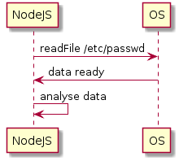
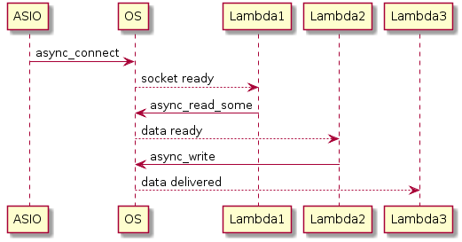

# boost::asio in context of C++11 and event-driven programming

###### Asynchronous I/O

## Syncronized Multithreading Paradigm

##### Downside Of Syncronized Multithreading

    - huge thread call stack (100+ frames)
    - 30 threads competing to write to one file => most of time spent in context switching

##### Context Switching Overhead

    - std::this_thread::yield()
    - std::mutex::lock()
    - ::read(int fd, void *buf, size_t count);

##### Estimated Times

    - Switch time:           ~0.000004 s
    - Switch happends every: ~0.001 s
<br/>
<br/>
<br/>
<br/>
<br/>
<br/>
<br/>
<br/>
<br/>
<br/>
<br/>
<br/>
<br/>
<br/>
<br/>
<br/>
<br/>
<br/>
<br/>
<br/>
## Event-Driven Programming

##### Node.js example

```javascript
fs.readFile('/etc/passwd',
    function (err, data) {
        if (err)
            throw err;
        console.log(data);
    });
```



##### poll() function

```c++
int poll(struct pollfd fds[], nfds_t nfds, int timeout); 
```

##### example

```c++
#include <stropts.h>
#include <poll.h>
...
struct pollfd fds[2];
int timeout_msecs = 500;
int ret;
int i;

/* Open STREAMS device. */
fds[0].fd = open("/dev/dev0", ...);
fds[1].fd = open("/dev/dev1", ...);
fds[0].events = POLLOUT | POLLWRBAND;
fds[1].events = POLLOUT | POLLWRBAND;

ret = poll(fds, 2, timeout_msecs);

if (ret > 0) {
    for (i=0; i<2; i++) {
        if (fds[i].revents & POLLWRBAND) {
            ...
        }
        if (fds[i].revents & POLLOUT) {
            ...
        }
        if (fds[i].revents & POLLHUP) {
            ...
        }
    }
}
```
<br/>
<br/>
<br/>
<br/>
<br/>
<br/>
<br/>
<br/>
<br/>
<br/>
<br/>
<br/>
<br/>
<br/>
<br/>
<br/>
<br/>
<br/>
<br/>
<br/>
## Lambda syntax in C++11

##### The most trivial case

```c++
int main()
{
    auto lambda = [] () { cout << "Hello world"; };
    lambda();
}
```

##### variable capture in lambda

```c++
int main()
{
    string hello = "Hello";
    auto lambda = [&] (const string& world) { cout << hello << world; };
    lambda(" world");
}
```
<br/>
<br/>
<br/>
<br/>
<br/>
<br/>
<br/>
<br/>
<br/>
<br/>
<br/>
<br/>
<br/>
<br/>
<br/>
<br/>
<br/>
<br/>
<br/>
<br/>
## Lambdas in boost::asio



```c++
socket.async_connect(server_endpoint,
    [&](std::error_code ec) // lambda1
    {
        socket.async_read_some(asio::buffer(data),
            [&](std::error_code ec, std::size_t length) // lambda2
            {
                    async_write(socket,
                        asio::buffer(data, length),
                        [&](std::error_code ec, std::size_t length) // lambda3
                        {
                            // ...
                        });
            });
    });
```
<br/>
<br/>
<br/>
<br/>
<br/>
<br/>
<br/>
<br/>
<br/>
<br/>
<br/>
<br/>
<br/>
<br/>
<br/>
<br/>
<br/>
<br/>
<br/>
<br/>
### Issues Related To Event-Driven Programming

    - thread stack very small
    - heap usually used instead of stack
    - difficult debugging
    - code flow may not be clear
    - trailing references
